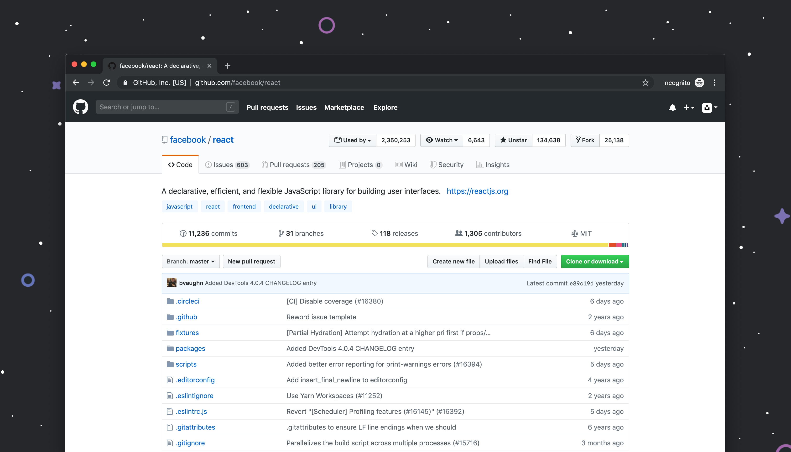

### Git 장점

- Git으로 파일을 관리하면, 업데이트 이력이 Git에 저장됨. (매번 백업용 파일 복사본을 만들지 않아도 됨)
  - 소스 코드가 변경된 이력 쉽게 확인하기
  - 특정 시점에 저장된 버전과 비교하기
  - 특정 시점으로 되돌아가기

---

### 저장소 Git repository

- 파일이나 폴더 저장해 두는 곳

- 파일을 변경 사항 별로 구분해 저장할 수 있다.

  - **원격 저장소** : 파일이 원격 저장소 전용 서버에서 관리되며 여러 사람이 함께 공유하기 위한 저장소
  - **로컬 저장소** : 내 pc에 파일이 저장되는 개인 저장소

- 내 PC의 로컬 저장소에서 작업하다가 작업한 내용을 고개하고 싶을 때에 원격 저장소에 업로드

---

### 변경을 기록하는 커밋

파일 및 폴더의 추가/변경 사항을 저장소에 기록하려면 커밋 누르기

- 40자리 이름
- 버그 수정, 기능 추가 등 작업별로 구분해서 커밋

> 1번째 줄 : 커밋 내의 변경 내용을 요약  
> 2번째 줄 : 빈칸  
> 3번째 줄 : 변경한 이유

#

---

### 작업트리(Work tree)와 인덱스(Index)

- 작업트리 = 폴더
- **인덱스** : 커밋을 실행하기 전의 저장소와 작업 트리 사이에 존재하는 공간
- **작업트리에서 html파일 수정 → '인덱스'에 파일 상태를 기록함(stage) → 커밋 → 저장소에 저장**
- 저장소에 변경 사항을 기록하기 위해서는?!
  - 기록하고자 하는 모든 변경 사항들이 '인덱스'에 존재해야 한다.
  - 만약 10개의 파일을 수정했지만, 그 중 7개만 저장소에 공개하고 싶다면?
    - 10개의 파일 중 7개를 선택하는 작업을 한다 = 인덱스에 동록(staging)

---

### 저장소 공유하기

### 원격 저장소에 푸쉬하기 / Push = 업로드

- 로컬 저장소의 변경 이력을 원격 저장소에 업로드하는 것

- 원격 저장소와 로컬 저장소가 동일한 상태가 됨

### 원격 저장소를 복제하기 / Clone

- 누군가의 변경 이력이 적용된 원격 저장소가 있을 때 사용

- 원격 저장소를 복제하기

- 원격 저장소의 내용을 통째로 다운로드함

### 원격 저장소에서 풀해오기 / Pull

- 다른 사람이 원격 저장소에 올려놓은(Push) 변경 내용을 내 로컬 저장소에도 적용(Pull)하기

- 원격 저장소에서 최신 변경 이력을 다운로드하여 내 로컬 저장소에 그 내용을 적용함

---

### 변경 이력의 통합

### 변경 이력 병합(Merge)하기

- 이미 파일이 변경되어 있어요.

  1. 내가 끌어온 저장소가 최신 버전이 아닌 경우(내가 pull을 실행한 후 다른 사람이 push를 하여 원격 저장소를 업데이트 해버린 경우에는 push 요청이 거부됨.
  2. 이런 경우 병합(merge)라는 작업을 진행하여 다른 사람의 업데이트 이력을 내 저장소에도 갱신하기
  3. 병합하지 않은 채로 이력을 덮어쓰게 되면 다른 사람이 push한 업데이트 내역이 사라져 버린다.

---

### 충돌 해결하기

- 원격 저장소와 로컬 저장소 양쪽에서 파일의 동일한 부분을 변경한 경우, 어느 쪽을 저장할 것인지 수정해주기.

---

### **참고사이트**

[누구나 쉽게 이해할 수 있는 Git 입문~버전 관리를 완벽하게 이용해보자~ | Backlog](https://backlog.com/git-tutorial/kr/)
