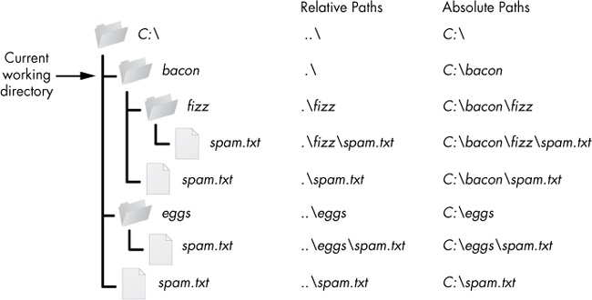

### 절대경로

- 웹페이지나 파일이 가지고 있는 **고유한 경로**, 위치, 주소
- 절대경로를 알고 있으면 그곳으로 바로 이동하거나 그곳에 있는 파일을 실행할 수 있다.

### 상대경로

- **'현재 위치'를 기준으로** 해서 보는 경로
- 웹이 기준이라면 html파일이 위치한 폴더가 현재 위치가 되어 상대적인 경로를 말함.

**/루트** (뿌리니까 최상위, 최상의 디렉토리)  
**./ 현재위치**  
**../ 현재위치의 상단폴더** (상위 디렉토리로 이동)

---

### 참고

[절대경로와 상대경로](https://88240.tistory.com/122)

[Automate the Boring Stuff with Python](https://automatetheboringstuff.com/chapter8/)
