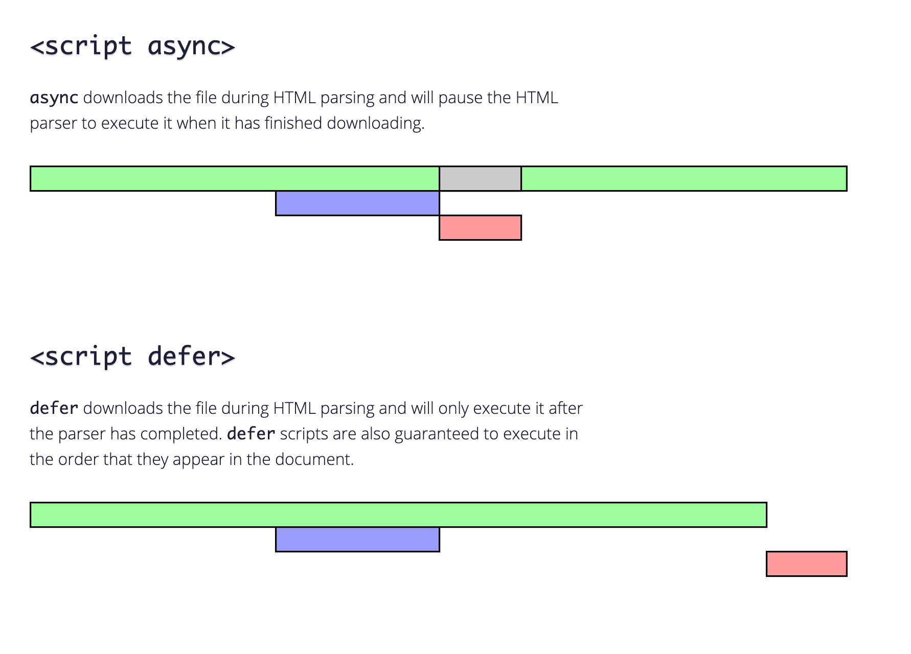

### 왜 궁금해졌어요?

어떤 코드에서 `<script>`태그가 작동되지 않는다고 해서 코드를 살펴보았더니 `<body>`태그 상단에 `<script>` 태그가 위치하고 있었다.
해결방법은 알려드렸는데 브라우저의 작동 원리가 궁금해서 찾아보았다.

### 브라우저는 어떻게 동작할까?

1.  브라우저가 웹 페이지를 만난다
2.  HTML을 읽는다(parsing)
3.  DOM 객체(DOM 트리)를 생성한다.
4.  Render 트리 (DOM tree + CSS의 CSSOM 트리 결합)이 생성된다
5.  Display에 표시한다.


이때, 브라우저가 HTML을 읽다가 `<script>....</script>` 태그를 만나면 스크립트를 먼저 실행해야 하므로 DOM 생성을 멈춘다.
즉 스크립트를 다운받고 실행한 뒤에야 남은 페이지를 처리할 수 있다.<br>
문제는 모던 웹 브라우저에서 돌아가는 스크립트들은 대부분 HTML보다 무거워서 다운받는데 오래시간이 걸리고, 처리하는데 시간이 더 걸린다.<br>

### 다시 정리하자면,

1. 스크립트에서는 스크립트 아래에 있는 DOM 요소에 접근할 수 없다. 따라서 DOM 요소에 핸들러를 추가하는 것도 불가함
2. 페이지 위쪽에 용량이 큰 스크립트가 있다면? 스크립트가 페이지를 막아버려서 스크립트 아래쪽 페이지를 볼 수 없다.

---

### 걱정마, 스크립트를 백그라운드에서 다운로드 받으면 되지!



# defer (지연)

브라우저 defer 속성이 있는 스크립트를 '백그라운드'에서 다운받기 때문에 스크립트를 다운로드 하는 도중에도 HTML 파싱이 멈추지 않는다.
defer 스크립트 실행은 페이지 구성이 끝날떄까지 지연된다.<b>DOM 트리가 완성된 후 지연(defer) 스크립트가 실행된다.</b>

```js
<p>...스크립트 앞 콘텐츠...</p>

<script defer src="https://javascript.info/article/script-async-defer/long.js?speed=1"></script>

<!-- 바로 볼 수 있네요! -->
<p>...스크립트 뒤 콘텐츠...</p>
```

- DOM이 준비된 후 실행되긴 하지만 DOMContentLoaded 이벤트 발생 전에 실행된다.

# 여기서 잠깐! DOMContentLoaded 이벤트가 뭐지?

### HTML문서의 생명주기에서 3가지 주요 이벤트

DOMContentLoaded : 브라우저가 HTML을 전부 읽고 DOM트리를 완성하는 즉시 발생함. 이미지나 스타일시트 등 기타 지원은 기다리지 않음<br>
load : HTML로 DOM트리를 생성 완료 + 이미지, 스타일시트같은 외부 자원도 모두 불러온 상태<br>
beforeunload/unload : 사용자가 페이지를 떠날 때 발생함<br>

### 생명주기 활용하기

DOMContentLoaded – DOM이 준비된 것을 확인한 후 원하는 DOM 노드를 찾아 핸들러를 등록해 인터페이스를 초기화할 때<br>
load – 이미지 사이즈를 확인할 때 등. 외부 자원이 로드된 후이기 때문에 스타일이 적용된 상태이므로 화면에 뿌려지는 요소의 실제 크기를 확인할 수 있음<br>
beforeunload – 사용자가 사이트를 떠나려 할 때, 변경되지 않은 사항들을 저장했는지 확인시켜줄 때<br>
unload – 사용자가 진짜 떠나기 전에 사용자 분석 정보를 담은 통계자료를 전송하고자 할 때<br>

# async

페이지와 완전히 독립적으로 작동한다. HTML 페이지는 async 스크립트 다운이 완료되길 기다리지 않고 페이지 내 콘텐츠를 출력한다.<br>
DOMContentLoaded 이벤트와 async 스크립트는 서로를 기다리지 않는다.<br>
그저 async 스크립트 다운로딩이 끝나면 실행된다. 따라서 DOMContentLoaded가 async 스크립트 실행 후에 발생할 수도 있다.<br>
이런 특징 때문에 페이지에 async 스크립트가 여러 개 있는 경우, 그 실행 순서는 다운로드가 끝난 순서대로 결정된다.<br>

```js
<p>...스크립트 앞 콘텐츠...</p>

<script>
  document.addEventListener('DOMContentLoaded', () => alert("DOM이 준비 되었습니다!"));
</script>

<script async src="https://javascript.info/article/script-async-defer/long.js"></script>
<script async src="https://javascript.info/article/script-async-defer/small.js"></script>

<p>...스크립트 뒤 콘텐츠...</p>

```

1. 비동기 스크립트 다운로드는 페이지 로딩을 막지 않기 때문에 페이지 콘텐츠가 바로 출력된다.
2. 먼저 로드되는 스크립트가 실행된다.
3. DOMContentLoaded 이벤트는 상황에 따라 비동기 스크립트 전이나 후에 실행된다. 정확한 순서를 예측할 수 없다.
4. small.js 다운로드가 먼저 끝나기 때문에 순서에서는 밑에 있지만 먼저 실행된다.

## 요약

### async와 defer 스크립트 공통점

다운로드 시 페이지 렌더링을 막지 않는다. 사용자를 기다리게 하지 않는다.

### async와 defer 스크립트 차이점

`defer` 스크립트 : 문서에 추가된 순서 , DOM 전체가 필요한 스크립트처럼 실행 순서가 중요한 경우에 사용함<br>
`async` 스크립트 : load- first-order, 실행순서가 중요하지 않는 경우에 사용함(방문자 수 카운터나 광고 관련 독립적인 스크립트의 경우)

---

### 참고

[defer, async 스크립트](https://ko.javascript.info/script-async-defer)<br>
[이미지참고, async vs defer attributes](https://www.growingwiththeweb.com/2014/02/async-vs-defer-attributes.html)<br>
[script 태그는 어디에 위치해야 할까요?](https://velog.io/@takeknowledge/script-%ED%83%9C%EA%B7%B8%EB%8A%94-%EC%96%B4%EB%94%94%EC%97%90-%EC%9C%84%EC%B9%98%ED%95%B4%EC%95%BC-%ED%95%A0%EA%B9%8C%EC%9A%94)<br>
