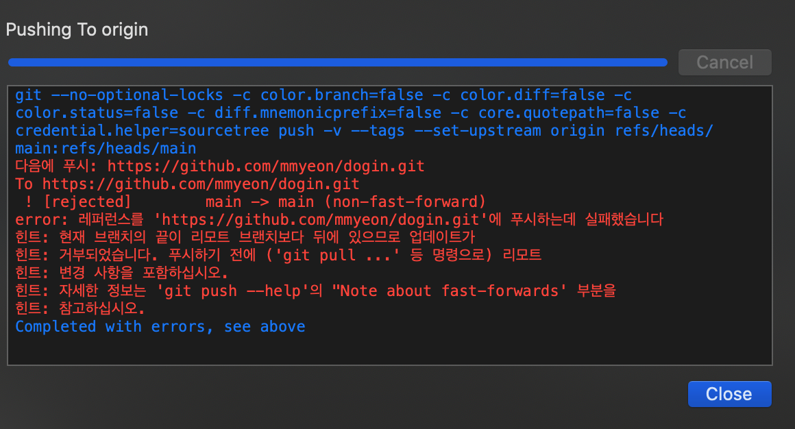

## 🔥 git push에 실패하다 🔥


## **문제 상황**

`리모트 저장소`에 push된 커밋인 줄 모르고 커밋을 삭제했더니 `로컬저장소`와 `리모트저장소`가 달라진 상황

이러한 상황을 인지하지 못한 채 코드 추가 뒤 push를 진행했더니
두둥 이런 메세지를 만났다.



구글 검색을 한 결과 해결책을 발견했다

```bash
git push -f
```

`로컬의 git 상태`를 리모트저장소로 **강제 push**하겠다는 뜻이다.

소스트리가 다시 깔끔해졌다.


---

## WILT : What I Leaned Today 🤔

👉 커밋을 삭제하기 전에 **로컬과 리모트 저장소가 동일**한지 체크한다.</br>
👉👉 git 오류 메세지를 꼼꼼히 읽은 덕분에 보다 빨리 해결할 수 있었다. **git 메세지를 꼼꼼히 읽자**.
