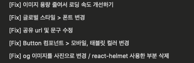
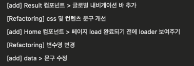
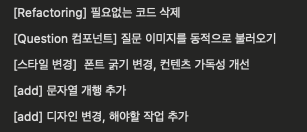

이전에 좋은 커밋에 대한 글을 남겼던 적이 있다.

[알아두면 좋은 커밋 메세지 작성요령](https://til.mmyeon.com/good-commit/)

### 과연 나는 커밋 메세지를 잘 작성하고 있을까?

---

## 나의 커밋 메세지 점검 일지

최근 작업했던 [`DogIn 프로젝트`](https://dogin.mmyeon.com/) 커밋 메세지를 관찰해보자

### 잘한 점

- type을 일관성있게 괄호 안에 작성

### 아쉬운 점

- type을 제한적으로 사용
- 대소문자를 섞어서 사용함
- 가끔 컴포넌트 이름을 type에 적음 → 아마 type에 대한 고려없이 작업한 듯

### 시간이 지나고 보니 정보를 전달하지 않는 커밋메세지만 남았더라 😥

그래서 `git commit message examples`로 구글링을 해보았다.
영어로 작성할 때 따르면 좋은 규칙에 대한 블로그 글이 많았지만,
개인 웹사이트에 적용하기에 구체적인 예시가 부족했다.
그러다가 아래의 블로그 글을 만나면서
**그래서 커밋 메세지를 왜 작성하는거지?** 라는 질문을 하게 되었다

[What makes a good commit message?](https://cvortmann.medium.com/what-makes-a-good-commit-message-995d23687ad)

### 그렇다. 커밋메세지의 주 역할은 '정보전달'이었던 것이다.

내가 쓴 코드도 시간이 지나면 기억이 안나고.. 
동료가 수정한 코드도 왜 했는지도 기억이 안나고.. 
그렇기 때문에 커밋메세지가 그토록 중요한 것이었다!

### 이 모든 작업의 종착점은 `커뮤니케이션`이다.🔥

> 소프트웨어 개발 팀에서 가장 중요한 것은 커뮤니케이션이다. (책 : Extreme Programming Explained)

### 중요한 건 알겠는데 그래서 어떡해야하지? ✌️

지켜야 할 것이 분명하지 않다면 하지 말아야 할 것을 파악해서 피해보자

<b>1. 어떠한 정보도 전달하지 않는 커밋메세지</b>

→ 커밋 메세지는 반드시 읽는 사람에게 정보를 전달해야 한다.

❌ `add cli new`

❌ `fixes`

❌ `fix code review comments`

❌ `no message`

❌ `description`

❌ `wip`

❌ `hackz`

<b> 2. 코드 변화가 아니라 외부의 소스에 대해서만 언급하는 커밋메세지</b>

-> 커밋 메세지만 읽어도 알 수 있도록 `코드를 왜 변경했는지를 적기`

❌ `Fix issue #123`

❌ `[JIRA-1234] Fix a problem with the route system when...`

---

## 다음 프로젝트에서 어떻게 적용해볼까나?

### 1. type을 반드시 명시한다

- `feat` : 새로운 기능 추가, 삭제, 변경
- `fix` : 버그 수정
- `docs` : 문서 추가, 삭제, 변경
- `style` : 코드 형식, 정렬 변경 (동적 영향을 주는 변경이 아님)
- `refactor` : 리팩토링
- `test` : production code에는 변화없지만 테스트 코드를 추가함
- `update` : 버전 업데이트
- `build`

### 2. 커밋 메세지에서 하나의 정보를 꼭 제공한다

---

## 참고

[What makes a good commit message?](https://cvortmann.medium.com/what-makes-a-good-commit-message-995d23687ad)

[협업시 GitHub 커밋 메시지 관리](https://mingnol2.tistory.com/129)
