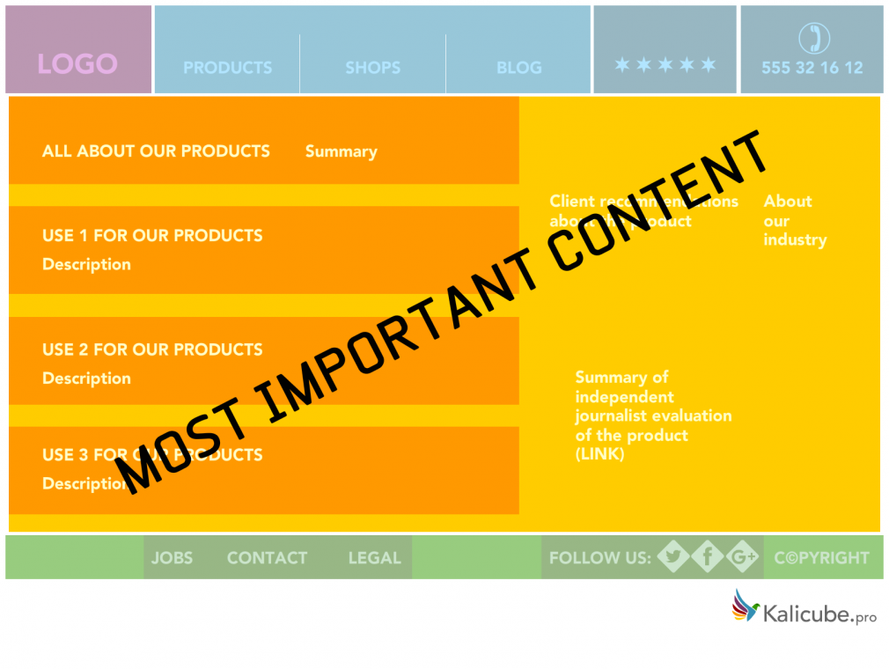
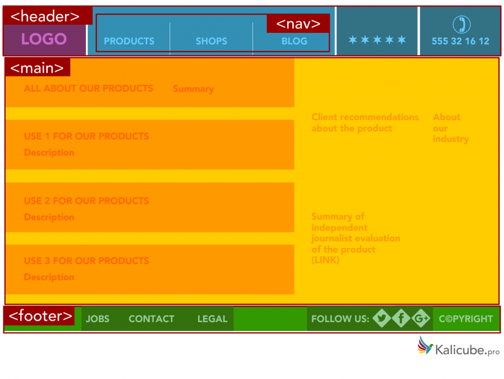
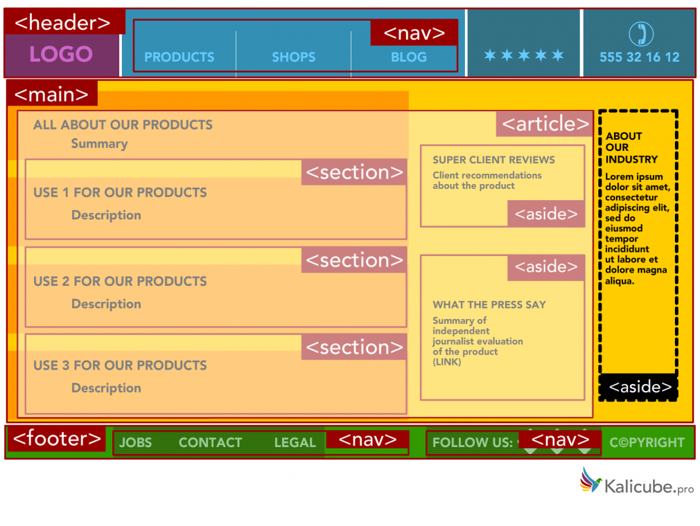
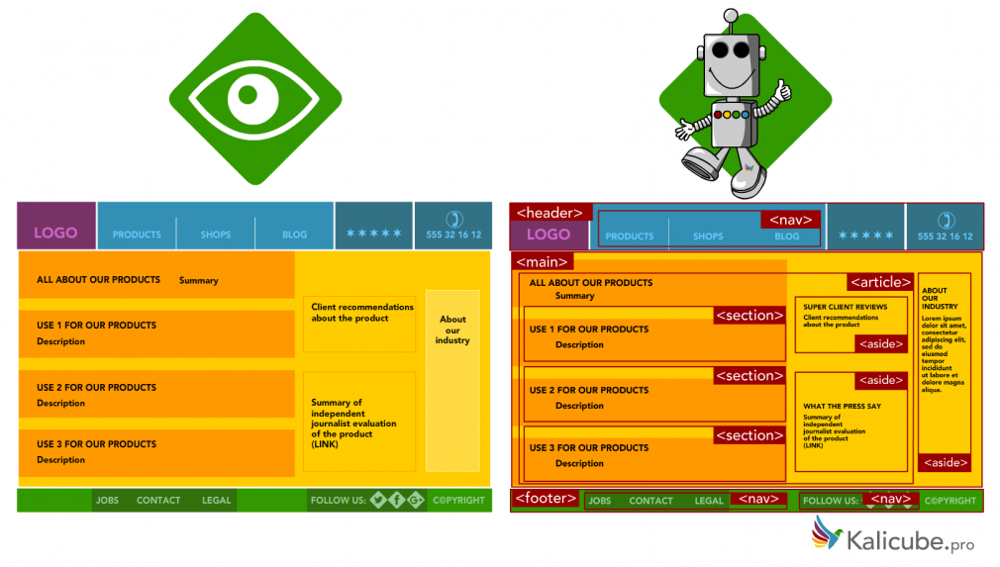

## 왜 궁금해졌나요?

프로젝트에서 폰트의 크기에 따라 `<h1>` `<h2>`를 사용하다 보니 시맨틱 태그를 잘못 사용하고 있다는 생각이 들어서 공부해보았다.

```html
<!-- 잘못된 태그 사용 -->
<div className="title-container">
  <h1 className="name">Hello</h1>
  <h2>I am</h2>
  <h1 className="job">Frontend Developer</h1>
</div>
```

---

## 시맨틱이 무슨 의미예요??

semantic은 코드 조각을 의미하는데, 이때 코드 조각은 어떻게 시각적으로 보여질지가 아니라 <b>이 코드가 어떤 효과를 있을지, 어떤 목적을 가지고 어떤 역할을 하는지</b>를 나타내는 말이다.

## 시맨틱 태그는 일반 태그와 다르다.

보통 스타일을 위해서 사용하는 `<div>`와 다르게 `<h1>`은 단순히 글자가 커서 사용하는 것이 아니라 이 페이지의 최상의 제목이라는 의미를 가질 때 사용한다.

그렇다면 `<span>`에 font-weight, font-size를 적용한 것과 `<h1>`를 사용한 것과는 어떤 차이가 있을까?

## 시맨틱 태그를 사용해야 하는 이유

✅ 다양한 유저가 접근할 수 있는 웹접근성이 향상된다<br>
시력이 있는 사람은 스타일이 적용된 문서를 보면 주요 컨텐츠를 파악할 수 있지만 크롤러 봇이나 스크린 리더를 사용하는 사람에게는 시각화된 문서에 접근하기 힘들기 때문에 문서 자체가 의미를 가져야 한다. 태그 자체가 어느 부분이 가장 중요한 컨텐츠인지 정의내리기 때문에 의미론적 마크업을 기준으로 페이지를 파악할 수 있다.

✅ 검색엔진에서 상위 노출될 수 있다<br>
크롤러 봇이 어떤 컨텐츠가 중요한지 더 잘 이해하는데 도움을 준다. 검색 사이트는 주기적으로 웹을 돌아다니면서 수집(crawling)을 하고 웹페이지를 분석한다. 이때 크롤러는 어떤 부분이 중요한 영역인지 모르기 때문에 시맨틱 태그를 사용해서 크롤러봇이 중요한 키워드를 파악할 수 있게 도와준다. 이는 검색 결과 상위에 문서가 노출되는 효과가 있다.

✅ 태그만 보아도 태그 안에 채워질 컨텐츠의 유형을 파악할 수 있다.

## 시맨틱 마크업을 잘 적용하는 방법은?

모든 태그로 `div`를 사용하기 보다는 내가 채울 데이터를 가장 잘 설명하고 나타내는 요소가 무엇일지 마크업을 하면서 질문해야 한다.

> 페이지에서 무슨 역할을 하지?<br>
> 머리글인가?<br>
> 바닥글인가?<br>
> 정렬된 리스트인가?<br>
> 아티클인가?<br>





## <mark> 디자인이 아니라 역할에 따라서 시맨틱 태그를 사용하기</mark>



## 자주 사용하는 HTML 태그 리스트

| 태그 이름      | 의미                                                                                       | 예시                            |
| -------------- | ------------------------------------------------------------------------------------------ | ------------------------------- |
| `<header>`     | 페이지나 섹션의 소개 정보를 포함하는 태그                                                  |                                 |
| `<nav>`        | 사이트 전체 흐름을 제어하는 태그                                                           | 메뉴, 목차, 색인                |
| `<main>`       | 본문을 뜻하고 콘텐츠 내용 전체를 감싸는 태그로 페이지 `<body>`당 하나의 `<main>`을 가진다. |                                 |
| `<article>`    | 페이지에서 독립적으로 사용할 수 있는 태그                                                  | 블로그 글, 게시판 글, 뉴스 기사 |
| `<aside>`      | 문서의 주요 내용과 간접적으로만 연관된 덜 중요한 컨텐츠                                    | 사이드 바                       |
| `<details>`    | "열림" 상태일 때만 내부 정보를 보여주는 공개 위젯, `<summary>`와 같이 사용                 |                                 |
| `<figure>`     | 독립적인 콘텐츠를 표현                                                                     | 이미지, 삽화, 코드 조각         |
| `<figcaption>` | 부모 `<figure>` 요소가 포함하는 다른 콘텐츠에 대한 설명(범례)                              |                                 |
| `<mark>`       | 특별히 봐야하는 부분이나 관련된 내용이라 하이라이트하는 태그                               |                                 |

### 사용 예시

```html
<header>Gecko facts</header>

<main>
  <p>
    Geckos are a group of usually small, usually nocturnal lizards. They are found on every
    continent except Australia.
  </p>

  <p>
    Many species of gecko have adhesive toe pads which enable them to climb walls and even windows.
  </p>
</main>
```

```html
<details>
  <summary
    >I have keys but no doors. I have space but no room. You can enter but can’t leave. What am
    I?</summary
  >
  A keyboard.
</details>
```

---

## 자주 헷갈리는 시맨틱 태그

<!-- ### <b> `<mark>`와 `<strong>`의 차이</b> -->

### `<mark>`와 `<strong>`의 차이</b>

| 태그 이름  | 설명                       |
| ---------- | -------------------------- |
| `<mark>`   | 연관성을 가진 부분에 사용  |
| `<strong>` | 중요한 부분 나타낼 때 사용 |

- 그냥 하이라이트 효과 주고 싶으면 `<span>`에 css 사용하기.

### `<section>`과 `<article>`의 차이

| 태그 이름   | 설명                                                                         |
| ----------- | ---------------------------------------------------------------------------- |
| `<article>` | 스스로 컨텐츠를 포함하는 독립적인 태그                                       |
| `<section>` | 비슷한 주제의 컨텐츠를 묶는 태그로 더 적합한 의미를 가진 태그가 없을 때 사용 |

- 주의 : `<section>`을 일반 컨테이너로 사용하지 말기. 일반 스타일링 목적이면 `<div>`사용하고 문서에서 해당 부분이 논리적으로 나타나야 하면 `<section>`사용

---

## 회고

- 어렴풋이 알았던 시맨틱 태그에 대해 공부했다. 웹접근성과 SEO에 중요하다는 사실을 알게 되니까 마크업할 때 좀 더 고민하면서 태그를 선택해야 겠다는 마음이 들었다. 공부한 내용을 바탕으로 현재 하고 있는 프로젝트의 태그를 다시 살펴봐야겠다. 아자아자!

---

## 참고

[Semantic Markup](https://html.com/semantic-markup/)

[Semantics - 용어 사전 | MDN](https://developer.mozilla.org/ko/docs/Glossary/Semantics)

[HTML5 Semantic Tags: What Are They and How To Use Them!](https://www.semrush.com/blog/semantic-html5-guide/)
