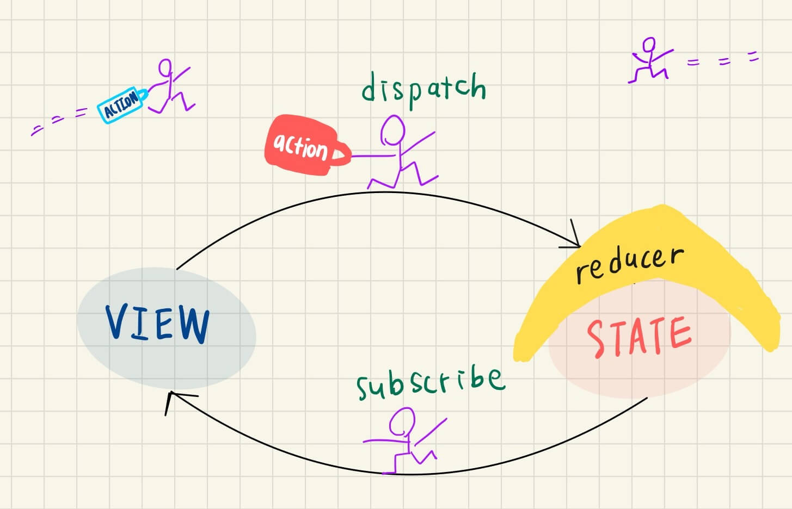

채용 공고에서 리덕스에 대한 언급이 많았다. 오호 그렇단 말이지 하면서 개인 프로젝트에 적용해보기 위해서 리덕스에 대해 알아보았다. 이전 프로젝트는 스테이트 관리가 복잡하지 않아서 contextAPI를 사용했기에 두 방법의 차이를 먼저 아는 게 필요했다.

---

## 리덕스와 contextAPI의 차이

### 컨텍스트

컨텍스트는 스테이트 관리 툴이 아니다. 리액트 컴포넌트의 네스트된 트리에 접근 가능한 싱글 가치를 만드는 게 목적이다. 다시 말해서 이미 스테이트 매니지먼트가 된 상태에서 트리를 타고 내려가서 스테이트에 접근할 수 있는 방법을 주는 것이다.

### 리덕스

스테이트 업데이트 로직을 분리하는 라이브러리이자 패턴이다. 언제, 어디서, 왜, 어떻게 스테이트가 바뀌었는지 발자국을 따라가기 쉽도록 도와주는 역할을 하며 어떤 컴포넌트에서든지 스테이트에 접근할 수 있게 도와준다

---

## Redux

### 리덕스란?

자바스크립트 애플리케이션들의 스테이트를 예측할 수 있도록 관리하는 방법이다.

### 특징

- 스테이트는 오직 읽기 전용이다.
- 데이터 관리가 매우 쉽다.
- 테스트 하기 쉽다.
- 단방향 데이터 플로우를 가진다.
- 스테이트 불변성을 유지한다.

### 리덕스 탄생 이유

리덕스 = 예측 가능한 스테이트 관리!
<br>
언제, 어디서, 왜, 어떻게 스테이트가 바뀌었는지 알기 위해서 만들어졌다.

### 리덕스에서 알아야 할 개념 4가지



- Store

  - 스테이트를 저장하는 곳으로 한 곳에서 스테이트를 관리합니다.
  - createStore함수가 데이터를 넣을 수 있는 스토어(장소)를 만들어줌
  - 리듀서를 전달받아서 스토어를 만든다.

- Reducer

  - 스테이트를 변경할 수 있는 유일한 함수이다.
  - 기존의 스테이트를 인자로 받아서 리듀서가 새롭게 리턴하는 값이 데이터가 된다.
  - 데이터가 변경되는 유일한 곳 = 단순하면서 강력한 리덕스 매직
  - 리듀서는 항상 새로운 스테이트를 리턴한다.

- Action

  - 리듀서가 아닌 외부에서 스테이를 변경하고 싶다면? 리듀서와 소통이 필요하다
  - 리듀서에게 제 스테이트를 어떻게 변경해달라는 내용이 담긴 액션을 전달하면 된다.
  - 액션은 타입을 키로 가지는 객체다.
  - 액션 타입은 상수 처리하기
  - 코드 최적화를 위해 액션 리턴하는 `actionCreators함수` 만들기

- Dispatch

  - 액션은 스테이트 변경에 대한 정보가 담긴 객체인데, 그럼 액션을 어떻게 리듀서에 전달할까? 디스패치가 다 해준다.
  - 리듀서에게 메세지를 전달해주는 함수이다.
  - 액션 객체를 가지고 `store.dispatch 함수`를 호출하면 액션을 전달받은 리듀서가 액션 타입에 따라 스테이트를 다르게 변경시킨다.
  - 버튼 클릭 → 디스패치 호출됨 → 액션 객체 전달받은 리듀서가 스테이트를 변경한다.

- Subscribe
  - 스토어를 구독하면 스토어에 생긴 변화를 모니터링 할 수 있다.
  - 스토어가 바뀔때마다 subscribe함수가 호출된다.

### 리덕스 장점

- 자바스크립트의 경우는 변경된 값을 전달해줘야지만 쓸 수 있다. 다시 말해서 UI를 바꾸고 있지만 데이터를 유지하지 않기 때문에 데이터가 없는 상태이다. 따라서 자바스크립트에서 데이터를 유지하려면 직접 데이터를 관리해야한다. 그리고 그걸 다시 HTML에 페인트 해줘야 한다.

- 리덕스를 사용하게 되면 리덕스가 데이터를 보관하는 스토어를 가지기 때문에 직접 데이터를 관리하지 않아도 된다. 이거 진짜 어썸함!!!!!

### 🔥 절대 스테이트를 변경하지 마라!!! 🔥

- 스테이트를 읽기 전용이라 절대로 바꾸면 안된다. 대신 새로운 스테이트를 리턴해야 한다.
- 새로운 스테이트는 전개연산자를 사용해 기존 스테이트 내부 값을 복사한 뒤 새로운 값을 추가하는 걸 뜻한다.
- 명심하자. 스테이트를 수정할 수 있는 유일한 방법은 액션을 보내는 것 뿐이다.

---

## React-Redux

- 자바스크립트에서는 새로운 투두가 생기면 리스트 전체 비우고, 스테이트에 있는 투두를 이용해서 새로운 리스트 만들어주는 작업을 해야한다. 리스트의 규모가 커지면 해야할 작업이 늘어난다. 하지만 리액트는 다르다!

- 리액트는 리페인트 하는데 매우 능숙하다. 대신 리액트는 모든 걸 리렌더 해주지 않는다. 리액트는 변화가 생긴 부분만 리렌더해준다. 리액트-리덕스가 필요한 순간이다. 스토어 변경사항에 대해 구독해서 스토어가 바뀔때마다 변경된 부분 다시 렌더링하면 된다.

- 리덕스 스토어에서 스테이트 가져와서 디스패치하기

### connect함수

- 컴포넌트들을 스토어에 연결해서 스토어의 스테이트를 props로 전달한다.
- 리듀서에 전달할 수 있는 디스패치함수를 프롭스로 전달받아서 호출한다.
- `mapStateToProps` : 스토어에서 스테이트 가져오는 방법
- `mapDispatchToProps` : 컴포넌트에서 디스패치를 호출할 수 있는 방법

### 리액트-리덕스 장점

- 컴포넌트는 스테이트에 대해서 전혀 신경쓰지 않아도 된다. 오로지 디스패치만 신경쓰면 된다.
- 리액트와 작업을 할 때는 리덕스는 신경쓰지 않아도 됨. 깔끔하다!
- 리액트-리덕스가 `subscribe`, `dispatch`를 대신 해주기 때문에 `connect함수`만 쓰면 호출하면 된다.

---

## 리덕스 툴킷

- 많은 코드를 써야하는 리덕스를 간단하게 사용할 수 있는 방법

* 적은 코드로 같은 기능하게 해줌
* 많은 지름길들이 있는 패키지 같은 것

### createAction

```jsx
// 변경 전
const ADD = "ADD";
const DELETE = "DELETE";

const addToDo = text => {
  return {
    type: ADD,
    text
  };
};

const deleteToDo = id => {
  return {
    type: DELETE,
    id
  };
};

const reducer = (state = [], action) => {
  switch (action.type) {
    case ADD:
      const newToDoObj = { text: action.text, id: Date.now() };
      return [newToDoObj, ...state];
    case DELETE:
      const cleaned = state.filter(toDo => toDo.id !== action.id);
      return cleaned;
    default:
      return state;
  }
};

// 변경 후
const addToDo = createAction("ADD");
const deleteToDo = createAction("DELETE");

const reducer = (state = [], action) => {
  switch (action.type) {
    case addToDo.type:
      const newToDoObj = { text: action.payload, id: Date.now() };
      return [newToDoObj, ...state];
    case deleteToDo.type:
      const cleaned = state.filter(toDo => toDo.id !== action.payload);
      return cleaned;
    default:
      return state;
  }
};
```

- 액션 타입과 액션 크리에이터를 정의내려주는 함수로 액션 타입을 전달받아서 액션 객체로 리턴해준다.
- 액션에게 전달하고 싶은 정보가 무엇이든 페이로드와 함께 보내진다.
- 액션 타입과 페이로드로 이루어진 액션 객체 만들어준다.

> 리덕스와 다른 점

- 액션을 정의내리지 않아도 되고, 자동적으로 어떠한 타입의 액션을 생성하고, 우리가 주는 값을 페이로드에 저장해준다.

### createReducer

```js
// 변경 전
const reducer = (state = [], action) => {
  switch (action.type) {
    case addToDo.type:
      const newToDoObj = { text: action.payload, id: Date.now() };
      return [newToDoObj, ...state];
    case deleteToDo.type:
      const cleaned = state.filter(toDo => toDo.id !== action.payload);
      return cleaned;
    default:
      return state;
  }
};

// 변경 후
const reducer = createReducer([], {
  [addToDo]: (state, action) => {
    state.push({ text: action.payload, id: Date.now() });
  },
  [deleteToDo]: (state, action) => state.filter(toDo => toDo.id !== action.payload)
});
```

- switch 문법 없이도 이전과 같은 기능을 한다.
- 스테이트와 액션 객체를 인자로 받아서 어떤 동작을 할건지 정의만 내리면 된다.
- `createReducer함수`를 사용하면 스테이트를 변경하기가 쉽다
- 리덕스 툴킷에서는 스테이트 변경이 허용된다.따라서 직접 스테이트를 변경하거나, 새로운 스테이트를 리턴해주면 된다.
- 스테이트 변경이 가능한 건 리덕스 툴킷이 immer 아래에서 작동하기 때문에 프로그램 내부에서 사용자를 대신해 스테이트를 복사해주기 때문이다.
- 🔥 중요한 건 항상 스테이트를 변경하거나 새로운 스테이트를 리턴해야한다!🔥

> createReducer 장점

- switch 문을 사용하지 않게 해준다.
- 스테이트 변경하게 해준다.

### configureStore

```jsx
const store = configureStore({ reducer });
```

- 브라우저에서 리덕스 개발자 툴 사용 가능하게 해준다.
- 실시간으로 스테이트에 어떤 액션이 발생했고, 그 때의 스테이트가 어떻게 변경되었는지 알 수 있다.

### createSlice

```jsx
const toDos = createSlice({
  name: "toDosReducer",
  initialState: [],
  reducers: {
    add: (state, action) => {
      state.push({ text: action.payload, id: Date.now() });
    },
    remove: (state, action) => state.filter(toDo => toDo.id !== action.payload)
  }
});
```

- `createAction`과 `createReducer`를 합친 것으로 강력하다.
- 초기 스테이트, 리듀서 함수 객체, 슬라이스 이름을 전달받는다.
- 자동적으로 액션 크리에이터, 액션을 만든다.

> createSlice 장점

- 코드라인 현저하게 줄일 수 있다.
- 모든 걸 캡슐화한다.

---

## 참고

[초보자를 위한 리덕스 101 - 노마드 코더 Nomad Coders](https://nomadcoders.co/redux-for-beginners)
[Why React projects still use Redux](https://dev.to/alexandrudanpop/why-react-projects-still-use-redux-in-2020-395p)
