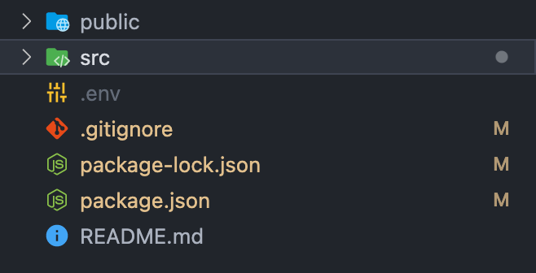
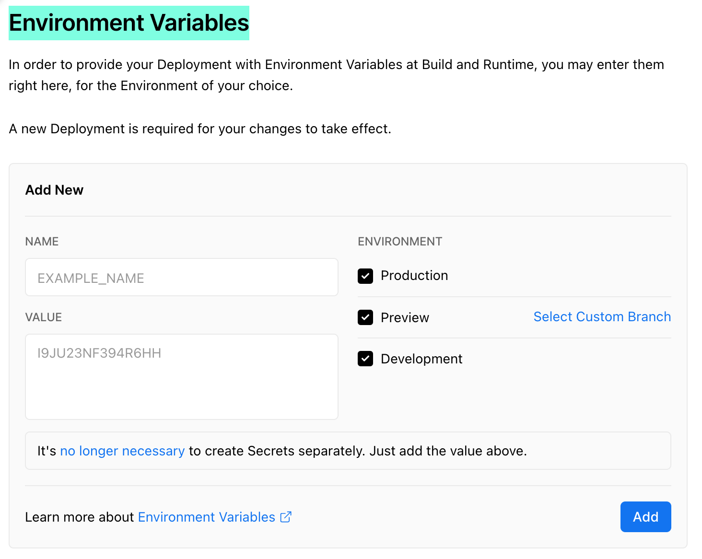

### 환경변수에 왜 숨겨야 하죠?

id, 인증키처럼 보안이 필요한 부분은 서버 시스템만 알 수 있도록 처리해야 한다.

### API 키를 한번 숨겨봅시다.



- `.env` 파일 만들기
- `.env` 파일 내부에 API 키 저장하기
- ⭐ 리액트의 경우는 API키를 입력할 때 다음과 같이 `REACT_APP_`를 입력해야 한다.

```env
REACT_APP_API_KEY = apiKey
```

- API키를 사용하려면 `process.env.API키 이름`으로 접근하면 된다.
- `.gitignore`에 `.env`파일을 추가해야 github에 관련 내역이 노출되지 않는다.
- ⭐ 환경 변수를 변경했으므로 서버를 다시 시작해야 한다.

### 왜 환경변수를 변경하면 서버를 다시 시작해야 하죠?

환경변수는 서버가 처음 실행될 때 한 번 세팅되므로 환경변수가 변경되면 서버를 다시 시작해야 변경사항이 적용된다.

### `dotenv` 라이브러리 설치안했는데 사용할 수 있네요?

CRA가 env 라이브러리에 의존성을 갖고 있기 때문에 설치하지 않아도 된다.

# 참고해야 할 부분

### 프로젝트 초반에 환경 변수를 설정하세요!

- 프로젝트 초반에 `.env` 파일 작업을 하지 않고 중반에 작업하니까 이미 깃헙에 `.env`가 올라가 숨긴 API 키가 그대로 노출되어 있었다.
- 그래서 깃헙에서 해당 커밋을 삭제했다.

### 애플리케이션이 돌아가는 환경에 API 키를 입력해주세요!

- 배포할 때 로컬에 숨긴 환경변수에 대한 정보를 제공해야 서버가 환경 변수에 대한 정보를 얻을 수 있다.
- 나의 경우 `Vercel`을 사용중이어서 해당 프로젝트 세팅에서 Environment Variables 입력해줬다.



---

### 참고

[create-react-app 에서 API key 숨기기](https://velog.io/@jason_sj/create-react-app-%EC%97%90%EC%84%9C-API-key-%EC%88%A8%EA%B8%B0%EA%B8%B0)

[Adding Custom Environment Variables | Create React App](https://create-react-app.dev/docs/adding-custom-environment-variables/)
