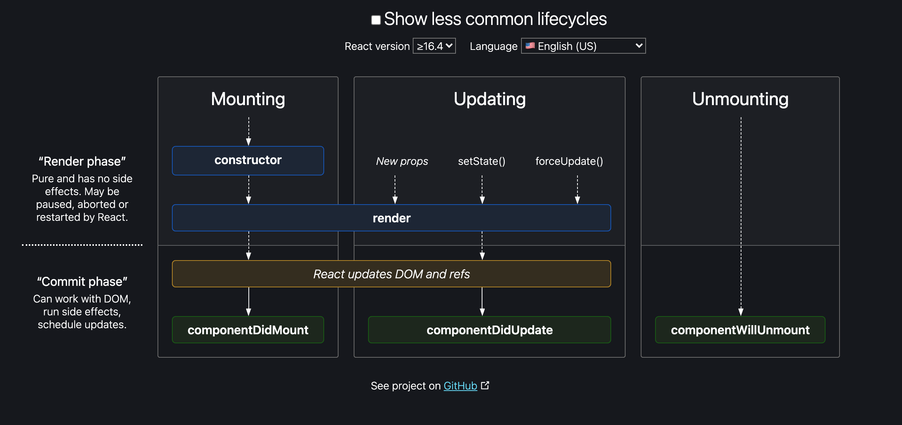

## 컴포넌트에는 3가지 라이프 사이클이 있다!

### Mounting

- `constructor`가 호출됨.
- 화면에 보여지는 `render`가 호출됨
- 리액트가 DOM과 ref를 업데이트함.
- 컴포넌트가 돔에 추가되었다고(mount) 알려주는 `componentDidMount`가 호출됨.

### Updating

- props나 스테이트가 변경되거나 `forceUpdate`가 호출됨.
- `componentShouldUpdate`가 호출됨.
- 화면에 보여지는 `render`가 호출됨. 리렌더됨.
- 리액트가 DOM과 ref를 업데이트함.
- 컴포넌트가 업데이트되었다고 알려주는 `componentDidUpdate`가 호출됨.

### Unmounting

- 더이상 마운트도 업데이트도 발생하지 않을 때 `componentWillUnmount`가 호출됨.
- 컴포넌트가 DOM에서 제거되면서 언마운트됨.

---

## 새롭게 알게 된 점

### 마운트의 의미

- DOM에 요소를 추가되는 걸 의미한다.

### 업데이트의 의미

- 이미 돔에 추가된(마운트된) 요소를 변경하는 걸 의미한다. DOM을 새로 추가하는 건 엄청난 비용이다. 리액트는 그 비용을 줄이기 위해서 `
`나 `<h2>`와 같은 요소를 통으로 변경하는 게 아니라 바뀐 값만 업데이트한다.
- 리액트는 props, state가 변경되거나 `forceUpdate`가 호출되면 컴포넌트 내부에서 어떤 부분이 바뀌었는지 확인한 뒤 그 변화를 가지고 돔을 업데이트 한다.

### shouldComponentUpdate()의 중요성

- 리액트는 위에서 말했듯이 state, props가 변경되거나 `forceUpdate`가 호출되었을 때 컴포넌트를 업데이트하기 위해서 리렌더된다. 문제는 컴포넌트에 영향을 주지 않는 값이 변경되어도 리렌더되고, 변경된 값이 이전과 같아도 setState()가 호출되었기 때문에 불필요한 리렌더링이 발생한다는 점이다. 따라서 `shouldComponentUpdate`를 잘 활용해서 불필요한 렌더링을 발생하지 않고 필요할 때만 렌더링되도록 하는게 중요하다. 값이 변경되었을 때 매번 리렌더 되는게 아니라 원하는 값이 변경되었을 때 리렌더 되도록 해야 성능이 개선될 수 있다.

### 컴포넌트 Unmount의 중요성

- 언마운트가 중요한 이유는 메모리 누수와 관련이 있기 때문이다. 가비지 컬렉션이 접근하지 못하거나 컴퓨터가 더이상 알 필요가 없는 코드들을 제거 하기 위해서 컴포넌트 클린업(언마운트)의 역할이 중요하다.

### 리액트의 라이프사이클을 이해해야 좋은 구조를 가진 애플리케이션을 만들 수 있다.

---

### 참고

[React Lifecycle Methods diagram](https://projects.wojtekmaj.pl/react-lifecycle-methods-diagram/)
